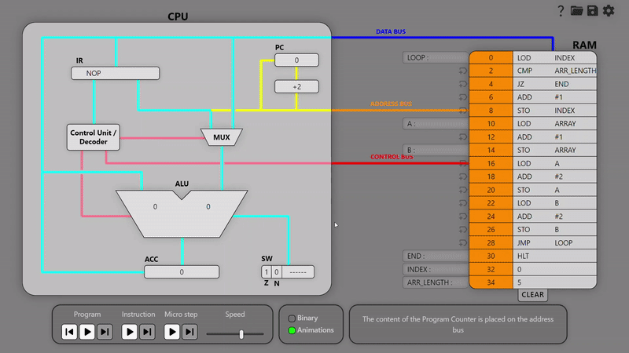

**A web-based, open-source, educational resource**

CPU Visual Simulator is a web based educational resource that allows students to input assembly language code directly into the RAM and visualize its execution.

Try it out at [https://jcancelli.github.io/cpu-visual-simulator/](https://jcancelli.github.io/cpu-visual-simulator/)

## Features

- 📖 Integrated manual
- ✏️ Editable RAM, Program Counter, Accumulator and Status Word
- 🎛️ Controllable execution and execution speed
- 🔊 Togglable audio explainations of the execution
- 📜 Togglable text explainations of the execution
- 🏷️ Labels can be associated to addresses and used as operands inside instructions
- 📂 Programs can be saved/loaded from human readable .cpuvs files
- 🟢 Easy to follow and toggleable animations
- 🔟 Toggleable binary representation of data
- 🎨 Customizable busses and busses animations colors
- 🌐 2 supported languages (english and italian) and more to come